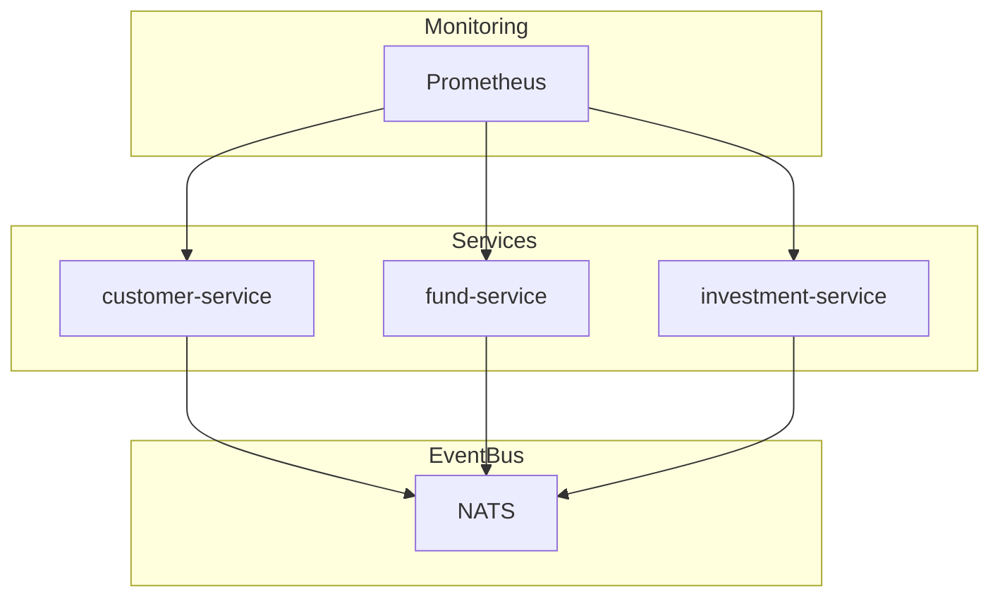

# Retail ISA Investments

This project is a microservices-based investment platform for managing ISA (Individual Savings Account) investments. It is built with Go and consists of three services:

customer-service: Handles customer data

fund-service: Manages available funds

investment-service: Manages customer investments into funds

All services are use NATS to handle events and expose RESTful APIs.

Monitoring is done using Prometheus, and logs are structured via Zap.

## Design



Each service publishes and listens to events on NATS.

Services expose HTTP APIs.

Metrics are collected via /metrics endpoints for Prometheus scraping.

Logs are configurable by environment variable (LOG_FORMAT=json|console).

## Running the project

### Prerequisites

- Docker
- Go 1.23
- [NATSClI](https://github.com/nats-io/natscli)

From the root of the project run:

```bash
docker-compose up --build
```

This will start:

- investment-service on port `8080`
- customer-service on port: `8081`
- fund-service on port `8082`
- NATS server on port `4222`
- Prometheus on port `9090`

### Example requests

#### Customer Service

```bash
# Create a customer
curl -X POST -H "Content-Type: application/json" \
  -d '{"name":"John Doe"}' \
  localhost:8081/customers

# Get all customers
curl localhost:8081/customers

# Get customer by ID
curl localhost:8081/customers/<customerId>
```

### Fund Service

An example fund to use is `fund-ftse-100`

```bash
# Get all funds
curl localhost:8082/funds

# Get fund by ID
curl localhost:8082/funds/<fundId>
```

### Investment Service

```bash
# Create an investment
curl -X POST -H "Content-Type: application/json" \
  -d '{"customerId": "<id>", "fundId": "<id>", "amount": 100}' \
  localhost:8080/investments

# Get investment by ID
curl localhost:8080/investments/<id>

# Get investments for customer
curl localhost:8080/investments/customer/<customerId>

```

## Monitoring

This uses Prometheus to scrape metrics from all the services, you can view the dashboard locally at
http://localhost:9090

The metrics surfaced are:
Each service exposes useful custom metrics:

### Customer Service

`customer_created_total`

`customer_creation_failures_total`

`customer_lookup_failures_total`

### Fund Service

`fund_requests_total (labels: path, method)`

`fund_lookup_failures_total (label: error_type)`

### Investment Service

`investment_created_total`

`investment_creation_failures_total (label: error_type)`
